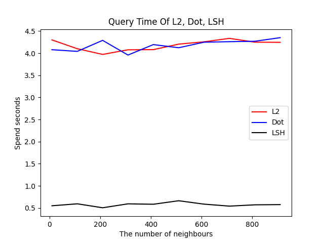
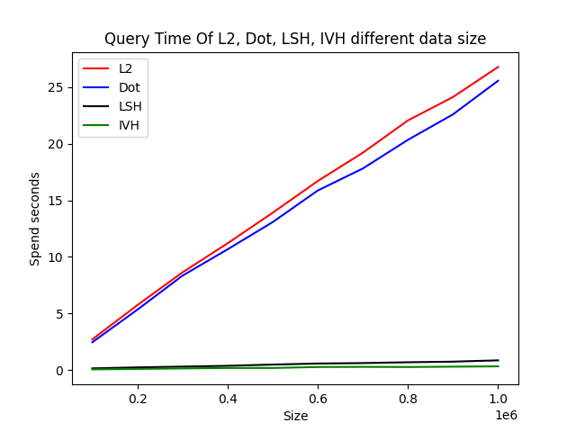

# Faiss Test Report

## Introduction

We have test faiss L2, IP(inner product) and LSH query speed. We prepare two testcases lists below:

1. Data shape is (16077, 768) and different neighbour number
2. Neighbour number is 10 and different vectors row number between 100 thousands and 1 million which dimension is 128.

Our test codes are in file `faiss_query.py`.

## Test Method

### Case 1: Relation of neighbour number and time

We construct L2, IP and LSH index first. Test their search time with different neighbour number in `arange(10, 1010, 100)` and iterate 1000 times.
Below is a chart of neighbour number and spend seconds.

### Case 2: Relation of vector row number and time

Iterate 100 times and dimension is 128, vectors row number are [0.1m, 0.2m, ..., 1m]. We plot the relation of vectors row number and time below.

## Conclusion

The LSH indexer is the fastest index, almost 10x faster than L2 and IP. In the case 1, average query time of LSH is around 0.5ms. 
In the case 2, the largest memory usage is less than 3G and the relation of time and vectors row number of L2 and IP are positive linearly.
However, the time of LSH query is constant.